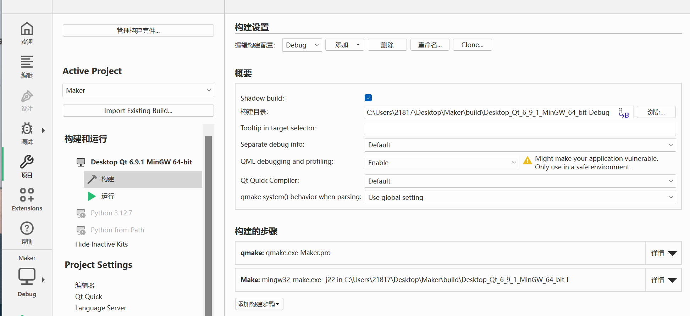
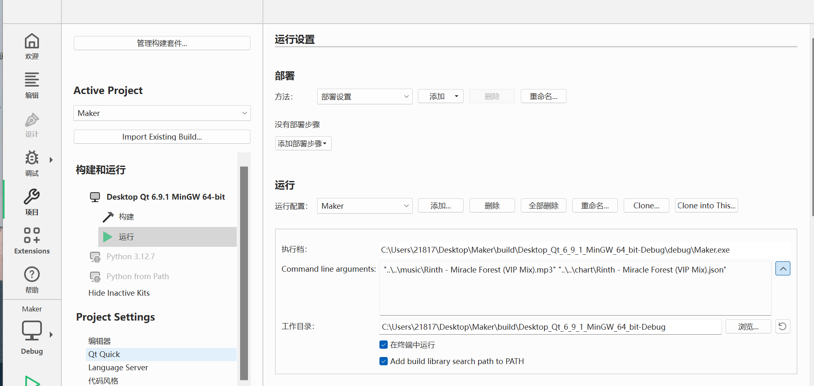

## 打谱工具
使用该工具，获取json格式的谱面文件

### 使用方法
0. 在一个方便的位置新建文件夹music和chart并记录路径
1. 将项目文件夹在QTCreator中打开
2. 在左侧点击“项目”
3. 构建设置如下：使用qmake

4. 运行设置如下：

command line arguments改为自己的文件夹路径
勾选“在终端中运行”
5. 完成设置后，在Creator内点击构建和运行
